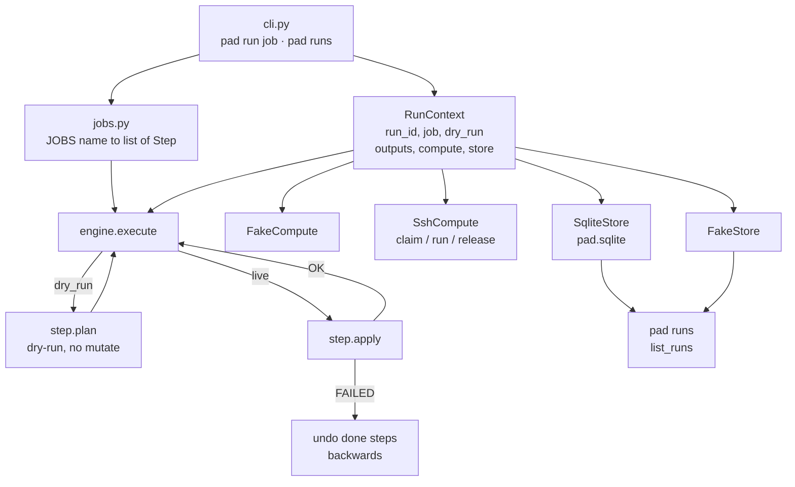

# pad

Small control plane for jobs made of steps.

Each step can `plan` (read-only), `apply` (do the work), and `undo` (compensate).
Drivers (fake, later SSH / Ansible / DNS) sit behind the context. The engine
does not know about vRO, Jenkins, or VirtualBox.

## Dev

```bash
python3 -m venv .venv
source .venv/bin/activate
pip install -e ".[dev]"
pytest
pad run demo --dry-run
pad run demo
```

## Ansible

```bash
python3 -m venv ~/ansible-env
source ~/ansible-env/bin/activate
pip install ansible-core
ansible-playbook ~/hello.yml
cat ~/hello-from-ansible.txt
```

## Status

Phase 1: engine + FakeCompute + pytest. No hypervisors yet.


